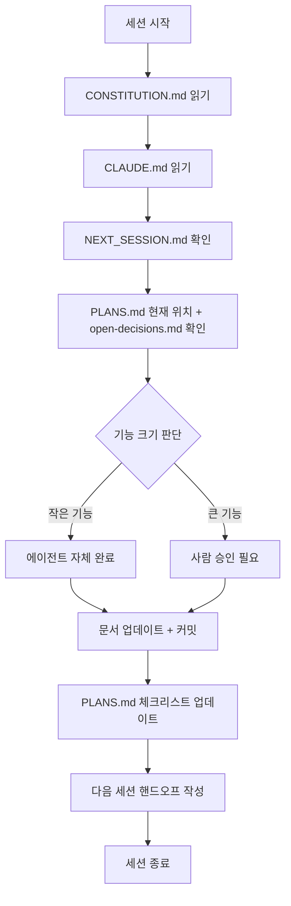

# AI Harness Engineering 스캐폴딩 시스템

AI 에이전트와 인간이 함께 작업하는 프로젝트를 체계적으로 관리하고 지속적으로 고도화하기 위한 문서화 및 워크플로우 프레임워크입니다.

## 🎯 핵심 목표

1. **정해진 양식으로 학습** — 프로젝트마다 새로운 원칙을 배우지 않고, 일관된 문서 구조와 프로세스 표준을 따름
2. **실행 루프 자동화** — 사람과 AI 에이전트의 역할을 명확히 하고, 반복 가능한 작업 흐름을 구축
3. **AI 에이전트 고도화** — 각 프로젝트의 경험을 축적하여 에이전트의 의사결정과 실행 능력을 지속적으로 개선

---

## 📚 세 가지 레이어

### 1. **Core Layer** (`core_docs/`)

모든 프로젝트가 따르는 **기본 표준**과 **템플릿**을 정의합니다.

| 문서 | 설명 |
|------|------|
| **WORKFLOW.md** | 사람-에이전트 반복 실행 루프의 표준. 세션/기능/Phase 레벨의 3가지 루프 정의 |
| **AGENTS_PATTERN.md** | 모든 에이전트의 필수 정의 형식. 담당/자율범위/승인범위/인수인계조건 4요소 |
| **ESCALATION_PROTOCOL.md** | 에이전트가 사람에게 보고해야 하는 상황 정의 |
| **CONSTITUTION_TEMPLATE.md** | 프로젝트의 불변 원칙(헌법) 템플릿. 데이터 무결성, 성능, 규정 준수 등 |
| **GLOSSARY_TEMPLATE.md** | 프로젝트 용어 정의. 팀 간 소통의 혼선 방지 |
| **QUALITY_SCORE_BASE.md** | 결과물 품질 평가 기준 (코드, 문서, 테스트 등) |
| **LESSONS_LEARNED.md** | 프로젝트 진행 중 발견한 교훈과 개선점 |
| **ANTI_PATTERNS.md** | 피해야 할 패턴들. 프로젝트별로 구체화됨 |
| **README_TEMPLATE.md** | 프로젝트 README 작성 표준 |
| **open-decisions-template.md** | 미결정 사항 추적 템플릿. 🔴Blocker / 🟡Decision / 🟢In Progress |
| **tech-debt-template.md** | 기술 부채 관리. 발생 이유/영향도/해결 우선순위 |

---

### 2. **Template Layer** (`templates_docs/`)

실제 프로젝트 타입별 **구체적인 예시와 설정**을 제공합니다.  
현재 두 가지 프로젝트 타입이 준비되어 있습니다:

#### **Game 프로젝트 템플릿** (`templates_docs/game/`)
게임 엔진 기반 프로젝트의 구조, 에이전트 정의, 실행 방식

| 문서 | 설명 |
|------|------|
| **CLAUDE.md** | 게임 프로젝트의 AI 에이전트 지침과 도구 설정 |
| **AGENTS.md** | 게임 개발의 구체적인 에이전트 역할 정의 (예: Game Architect, Implementer 등) |
| **ARCHITECTURE_GUIDE.md** | 게임의 코어 아키텍처 설계 가이드 |
| **QUALITY_SCORE.md** | 게임 프로젝트의 품질 평가 기준 |
| **orchestrate.md** | 에이전트 간 작업 흐름 조율 |
| **run-qa.md** | QA 테스트 및 검증 프로세스 |
| **sync-docs.md** | 문서와 코드 동기화 방식 |

#### **SaaS 프로젝트 템플릿** (`templates_docs/saas/`)
웹 애플리케이션 기반 프로젝트의 구조, 에이전트 정의, 실행 방식

| 문서 | 설명 |
|------|------|
| **CLAUDE.md** | SaaS 프로젝트의 AI 에이전트 지침과 도구 설정 |
| **AGENTS.md** | SaaS 개발의 구체적인 에이전트 역할 정의 (예: Backend Implementer, Frontend Implementer 등) |
| **ARCHITECTURE_GUIDE.md** | SaaS의 백엔드/프론트엔드 아키텍처 설계 가이드 |
| **QUALITY_SCORE.md** | SaaS 프로젝트의 품질 평가 기준 |
| **orchestrate.md** | 에이전트 간 작업 흐름 조율 |
| **review.md** | 코드 리뷰 및 검증 프로세스 |
| **sync-docs.md** | 문서와 코드 동기화 방식 |

#### **프로젝트 계획 템플릿**
모든 프로젝트 타입의 초기 계획 수립

| 문서 | 설명 |
|------|------|
| **PLANS_TEMPLATE.md** | 프로젝트 로드맵, Phase별 목표, 체크리스트 |

---

### 3. **Project Layer**

새로운 프로젝트를 시작할 때, **Core Layer** + **Template Layer**를 조합하여 구성합니다.

```
새 프로젝트
├── CONSTITUTION.md          (Core: CONSTITUTION_TEMPLATE.md 를 프로젝트에 맞게 작성)
├── CLAUDE.md                (Template: 선택한 프로젝트 타입의 CLAUDE.md 를 상속)
├── AGENTS.md                (Template: 선택한 프로젝트 타입의 AGENTS.md 를 상속)
├── PLANS.md                 (Template: PLANS_TEMPLATE.md 를 프로젝트 계획에 맞게 작성)
├── GLOSSARY.md              (Core: GLOSSARY_TEMPLATE.md 를 프로젝트 용어로 구체화)
├── ARCHITECTURE.md          (Template: 해당 프로젝트 타입의 ARCHITECTURE_GUIDE.md 참조)
├── QUALITY_SCORE.md         (Template: 해당 프로젝트 타입의 QUALITY_SCORE.md 를 프로젝트에 맞게 커스터마이징)
├── open-decisions.md        (Core: open-decisions-template.md)
├── tech-debt.md             (Core: tech-debt-template.md)
├── LESSONS_LEARNED.md       (Core: 프로젝트 진행 중 채워짐)
└── docs/exec-plans/
    └── NEXT_SESSION.md      (세션 간 핸드오프 문서)
```

---

## 🔄 실행 흐름

### 세션 루프 (인간-에이전트 반복)



### 기능 분류 기준

| 기준 | 작은 기능 | 큰 기능 |
|------|---------|--------|
| **스키마 변경** | 없음 | 있음 |
| **외부 API 연동** | 없음 | 있음 |
| **CONSTITUTION 영향** | 없음 | 있음 |
| **에이전트 처리** | 자체 완료 | 사람 승인 필요 |

---

## 🚀 시작하기

### 1. 새로운 프로젝트 초기화

```bash
# 프로젝트 폴더 생성
mkdir my-ai-project
cd my-ai-project

# Core Layer에서 필수 템플릿 복사
cp ../core_docs/CONSTITUTION_TEMPLATE.md ./CONSTITUTION.md
cp ../core_docs/GLOSSARY_TEMPLATE.md ./GLOSSARY.md
cp ../core_docs/open-decisions-template.md ./open-decisions.md
cp ../core_docs/tech-debt-template.md ./tech-debt.md

# Template Layer에서 프로젝트 타입 선택 (SaaS 예시)
cp ../templates_docs/PLANS_TEMPLATE.md ./PLANS.md
cp ../templates_docs/saas/CLAUDE.md ./CLAUDE.md
cp ../templates_docs/saas/AGENTS.md ./AGENTS.md
cp ../templates_docs/saas/ARCHITECTURE_GUIDE.md ./ARCHITECTURE.md
cp ../templates_docs/saas/QUALITY_SCORE.md ./QUALITY_SCORE.md

# 문서 맞춤화
# → CONSTITUTION.md, CLAUDE.md, AGENTS.md, PLANS.md 를 프로젝트에 맞게 수정
```

### 2. 각 문서의 역할 이해

- **시작 전**: `CONSTITUTION.md` 읽기 (프로젝트의 불변 원칙)
- **매 세션 시작**: `CLAUDE.md` → `PLANS.md` → `open-decisions.md` 확인
- **기능 구현**: `AGENTS.md` 의 에이전트별 역할 확인
- **진행 추적**: `PLANS.md` 의 Phase별 체크리스트 업데이트
- **세션 종료**: `NEXT_SESSION.md` 작성으로 다음 세션 준비

### 3. 지속적 개선

- **각 세션 후**: `LESSONS_LEARNED.md` 에 배운 점 기록
- **기술 부채 발생 시**: `tech-debt.md` 에 즉시 등록
- **의사결정 필요 시**: `open-decisions.md` 에 항목 추가
- **프로젝트 종료 후**: Core/Template Layer 개선사항 검토 및 반영

---

## 📊 문서 체계 요약

```
AI Harness Engineering
│
├─ Core Layer (모든 프로젝트의 공통 표준)
│  ├─ 워크플로우: WORKFLOW.md
│  ├─ 에이전트: AGENTS_PATTERN.md
│  ├─ 프로토콜: ESCALATION_PROTOCOL.md
│  └─ 템플릿: CONSTITUTION, GLOSSARY, QUALITY_SCORE, 
│     LESSONS_LEARNED, ANTI_PATTERNS, README, 
│     open-decisions, tech-debt
│
├─ Template Layer (프로젝트 타입별 구체 예시)
│  ├─ Game: CLAUDE.md, AGENTS.md, ARCHITECTURE_GUIDE.md, QUALITY_SCORE.md, ...
│  └─ SaaS: CLAUDE.md, AGENTS.md, ARCHITECTURE_GUIDE.md, QUALITY_SCORE.md, ...
│
└─ Project Layer (실제 프로젝트)
   └─ Core + Template를 조합한 프로젝트 문서
```

---

## 💡 핵심 개념

### CONSTITUTION (헌법)
프로젝트가 절대 타협하지 않는 원칙들. 에이전트가 작업 중 반드시 확인해야 하는 제약사항.

### WORKFLOW (세 가지 루프)
- **Level 1 (세션)**: 한 번의 Claude Code 세션
- **Level 2 (기능)**: 한 개 기능 완성
- **Level 3 (Phase)**: 한 개 Phase 완료

### AGENTS (역할 정의)
각 에이전트가 할 수 있는 일(자율), 반드시 물어봐야 할 일(승인), 언제 완료인지(인수인계 조건)

### open-decisions (미결정 사항)
🔴 Blocker(진행 불가), 🟡 Decision(선택 필요), 🟢 In Progress(작업 중)

---

## 🔗 참고 자료

- **WORKFLOW.md**: 인간-에이전트 협업의 구체적인 실행 방식
- **AGENTS_PATTERN.md**: 에이전트 정의의 4가지 필수 요소
- **ESCALATION_PROTOCOL.md**: 언제 멈추고 사람에게 보고할 것인가
- **각 프로젝트 타입별 Template**: 실제 작업 예시 및 구체적 가이드

---

## 📝 문서 갱신 현황

이 문서들은 실제 프로젝트 경험을 통해 지속적으로 개선됩니다.

- ✅ Core Layer: 기본 표준 완성
- ✅ Template Layer: Game, SaaS 템플릿 기본 제공
- 🔄 Project Layer: 실제 프로젝트 적용 중
- 📋 ANTI_PATTERNS.md: 3차 생성 예정 (프로젝트 경험 축적 후)

---

**Version**: 1.0  
**Last Updated**: 2026-04-16
